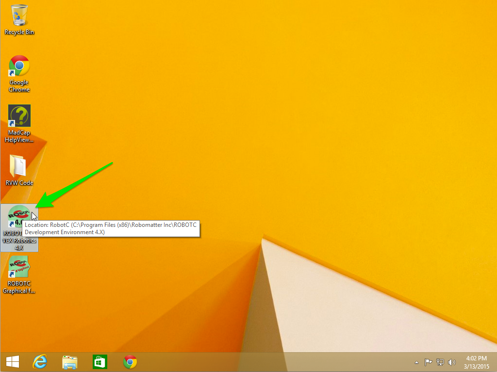
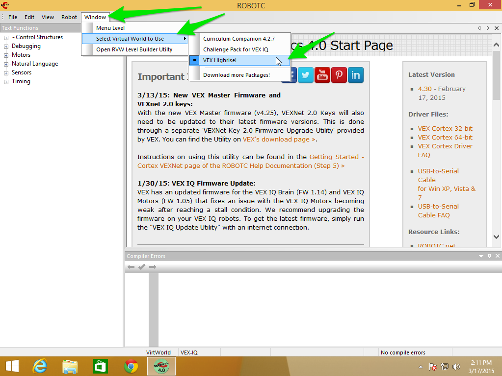
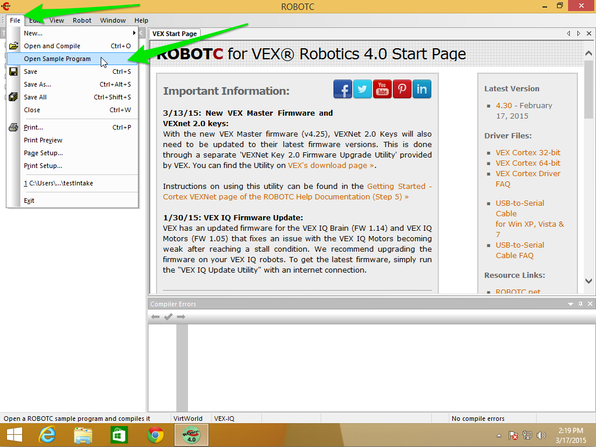
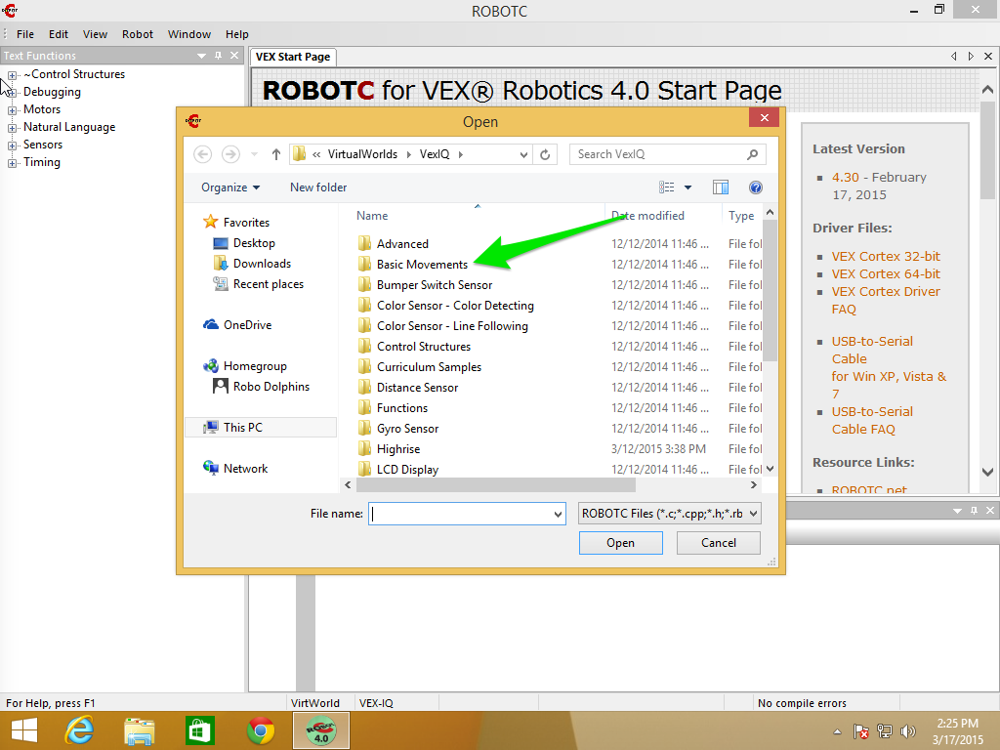
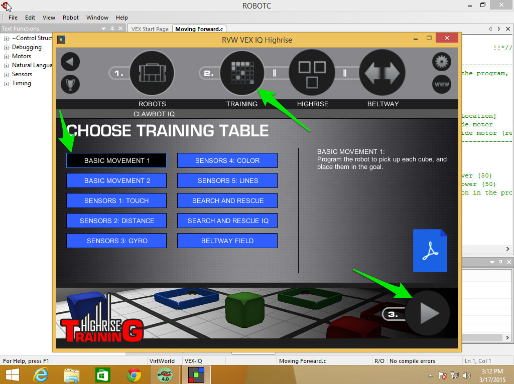
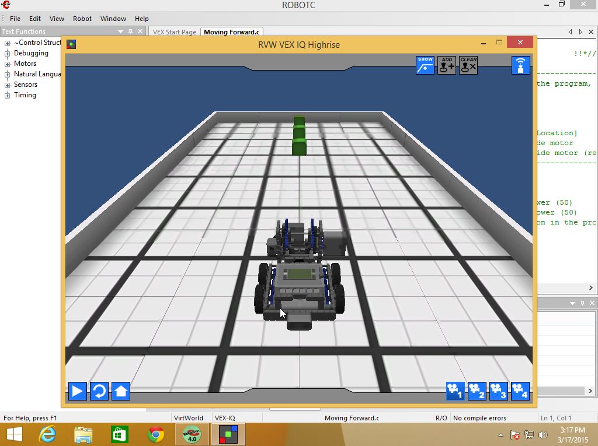
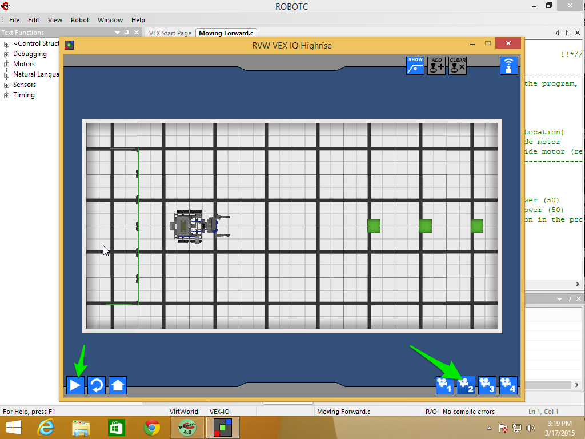

# Chapter 1 - Getting Started

## Getting Started

We're going to be doing all of our programming inside the ROBOTC IDE and running are programs on virtual robots inside Robot Virtual Worlds.

There's a few steps we need to take care of:

1. Launch the ROBOTC IDE
2. Set the Compiler Target to **Robot Virtual Worlds**
3. Choose the right Virtual World
4. Run a sample program to make sure everything works

### 1. Launching the ROBOTC IDE

To bring up the ROBOTC IDE find and double click on the **ROBOTC for VEX Robotics** shortcut.  Not **Graphical** and not **Robot Virtual Worlds**:

### 2. Setting the Compiler Target

Set the compiler target to **Virtual Worlds**:

* Click on the **Robot** menu item
* Then select **Compiler Target**
* Then select **Virtual Worlds**

You'll know you have that correct when the dot is next to **Virtual Worlds**.

### 3. Choose the Virtual World

Now that we've set the Compiler Target to Robot Virtual Worlds we can chooose the correct World for our purposes:

* Click on the **Window** menu item
* Then **Select Virtual World to Use**
* Then **VEX Highrise!**

_Note: If you don't see **Select Virtual Worlds to Use** or **Open RVW Level Builder Utility** under the **Window** menu item then you probably haven't chosen **Virtual Worlds** as the compiler target, go back to Step 2._

### 4. Run a sample program

Next we're going to run a sample program to make sure we have everything set up correctly.

First, go to the **File** menu and select **Open Sample Program**

Next, inside the File Open Dialog double click on **Basic Movements**

Then open the program **Moving Forward.c**.  You can do this two ways:

* Double click on the file **Moving Forward.c**
* Single click on the file **Moving Forward.c** and then clicking **Open**

At this point you should see **Moving Forward.c** in the main code window in the ROBOTC IDE.  So we should be able to Compile, Download and Run the program.

_Hint: the two "thumb tacks" I'm pointing to in the screenshot will "un-pin" the panels and let them autohide to give you more space in the editor._

At this point we need to save our program somewhere else so ROBOTC doesn't complain we're trying to overwrite the sample program.  From the **File** Menu
select **Save As...** and choose a place to save the file.  _For students, this would be in your student directory under your Teacher's directory (or folder)._

Now we can compile.  Like many things, there are at least two ways you can compile and download the program to the virtual robot:

* Hitting the function key **F5**
* Choosing the **Robot** menu item, then choosing **Compile and Download Program**

_Hint: If you look at the highlighted menu item, on the right you'll see **F5**, that's the Keyboard Shortcut for **Compile and Download Program**._

After the program compiles it will bring up the Robot Virtual Worlds login window.  We want to log in locally as a Guest (for now):

1. Click on the blue **Log in Locally** tab
2. Click on **Log In as Guest** button

From the Home Screen we need to verify a two things:

1. That **Clawbot IQ** is the selected robot

2. That the Training Table is **Basic Movement 1** (do this by clicking the **Training** Circle, also labeled #2)

Now we should be ready to go.  Press the Play Button (labeled #3) and you should see a VEX IQ Field with 3 green cubes and a Clawbot robot.

Change the view to **Camera 2** and Hit Play.  Your robot should move forward.

